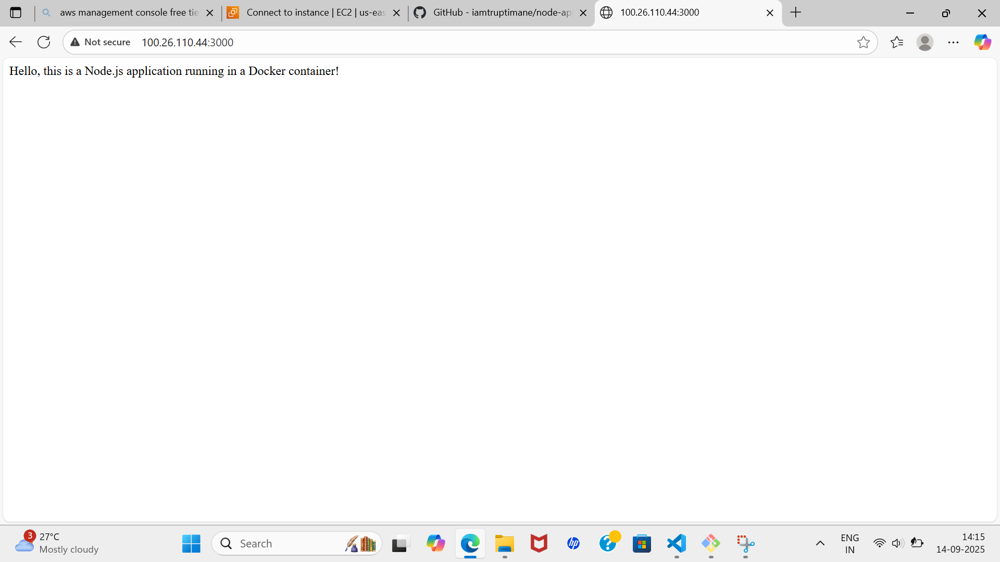

# 🚀 Deploying a Node.js Application on AWS EC2

##  Introduction
This project shows how to deploy a Node.js application on an AWS EC2 instance. Node.js is a fast and lightweight runtime for building scalable web apps, and EC2 offers a flexible cloud environment to host them.
 Before starting, make sure you have
- Launching an EC2 instance
- Installing Node.js and npm
- Uploading/cloning your app
- Running the app
- Using PM2 to keep it alive after restarts

---

##  Prerequisites

Before you begin, make sure you have:

- An AWS account with EC2 launch permissions  
- A key pair (`.pem` file) to connect via SSH  
- Security Group with:
  - Port `22` open (SSH access)
  - Port `3000` open (or your app’s port)
- SSH client (e.g., Git Bash) installed locally

---

## Steps to Deploy

## Step 1: Launch EC2 & Connect via SSH
1. Launch a new EC2 instance (Amazon Linux)

2. Copy the SSH command from AWS console
   ```bash
   ssh -i "your-key.pem" ec2-user@your-ec2-public-ip```
   Step 2: Update Packages & Install Node.js
   ```
3. Paste it into Git Bash to connect:

---
## Step 2: Update Packages & Install Node.js
1. Update system and Install Node.js packages
   ``` bash
   sudo yum update -y
   sudo yum install nodejs -y
   ```
   
   
2. Install npm

   ```sudo yum install npm -y```
   

---
## Step 3: Upload or Clone Your App

1. Install Git

   ```sudo yum install git -y```
   

2. Clone your Node.js app
  
   `git clone <your-repo-url>`
   

3. Navigate into the project folder

   ```cd node-app```
   
---
## Step 4: Install Dependencies & Run App
1. Install dependencies
    ``` sudo npm install ```
   
   
2. Run the app

   ``` node app.js ```
   
---
## Step 5: Keep App Running with PM2
1. Install PM2 globally

   ```sudo npm install -g pm2```
   
   
2. Start the app with PM2 

   ```pm2 start app.js```
   
   
3. Optional: Save PM2 process list

   ```pm2 save```

4. Optional: Enable PM2 startup on reboot

   ```pm2 startup```
---
## Step 6: Access Your App
Open your browser and visit:

  ```http://<your-ec2-public-ip>:3000```
  
---
# Summary

You’ve successfully deployed a Node.js app on AWS EC2 using PM2 for process management. Your app is now accessible online and stays running even after server restarts.
